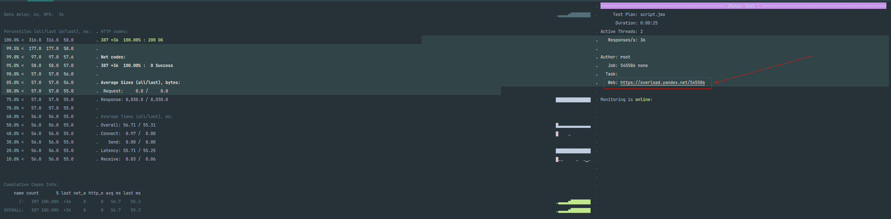

# Нагрузочное тестирование.

Проект нагрузочного тестирования с применением [Jmeter](https://jmeter.apache.org/) и [Yandex.Tank](https://yandextank.readthedocs.io/en/latest/intro.html).

### Прежде чем приступить к работе убедитесь, что у вас уже установлено/имеется:

* [Docker](https://docs.docker.com/desktop/)
* [Git](https://github.com/git-guides/install-git)
* token от сервиса визуализации yandex. Токен получаем [тут](https://overload.yandex.net/login/?next=/).

### Как запустить тесты:
1. Клонируем к себе проект:
```
git clone https://github.com/rusystem/yandextank-jmeter-load.git
```
2. Заменяем в директории 'load/resources' script.jmx на свой JMeter сценарий с наименованием script.jmx 
3. В директории load, а именно в файл token.txt вставляем полученный token от overload.yandex.
4. Переходим в терминале в директорию yandextank-jmeter-load/load
```
cd yandextank-jmeter-load/load
```
5. Создаем образ Docker для нагрузочного тестирования, который в последствии можно использовать:
```
docker build -t loadtest --no-cache . 
```
6. Запускаем наши тесты:
```
docker run -ti --rm --network host loadtest yandex-tank -c load.yaml
```

* Параметры, которые присутствуют в load.yaml:

| key        | value            | description                                                                                                                                                       | 
|------------|------------------|-------------------------------------------------------------------------------------------------------------------------------------------------------------------|
| token_file | token.txt        | Текстовый файл с токеном из overload.yandex.net.                                                                                                                  |
| autostop   | time(3s,10)      | Условие для автоматической остановки теста. В этом случае тест завершится сам по себе, если в течение 10 секунд ответы от сервера будут поступать более 3 секунд. |
| autostop   | http(5xx,20%,5s) | Условие для автоматической остановки теста. В этом случае тест завершится сам по себе, если в течение 5 секунд будет обнаружено 20% ошибок 5xx.                   |

### Где увидеть результаты:
* На скриншоте ниже вы можете увидеть ссылку на отчет. Просто нажмите на нее в терминале.
<p align="center">
  
</p>

* Сервис визуализации - https://overload.yandex.net/